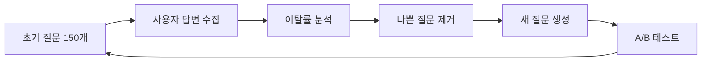

# FLIO 질문 데이터베이스 구축 전략

## 📊 Public 데이터셋 (무료)

### 1. OKCupid Dataset ⭐⭐⭐⭐⭐
- **규모:** 68,371명 사용자, 2,626개 변수
- **출처:** Figshare, Open Science Framework (OSF)
- **내용:**
  - 기본 프로필 질문 (나이, 위치, 직업 등)
  - 가치관 질문 (~300개 질문 포함)
  - 라이프스타일 선호도
  - 데이트/관계 기대치
- **라이센스:** Educational/Research use (상업용 직접 사용 불가, 참고용으로 활용)
- **링크:** https://figshare.com/articles/dataset/OKCupid_Datasets/14987388
- **활용 방법:** 질문 구조와 패턴 분석, 우리 질문 개발 시 참고

### 2. Stanford HCMST (How Couples Meet and Stay Together) ⭐⭐⭐⭐
- **규모:** 11,196 커플, 종단 연구
- **출처:** Stanford Libraries Social Science Data Collection
- **내용:**
  - 커플 형성 과정
  - 관계 지속/해체 요인
  - 장기 관계 만족도 예측 변수
- **라이센스:** Academic (무료 배포 가능하지만 비용 청구 불가)
- **링크:** https://data.stanford.edu/hcmst
- **활용 방법:** 중요한 호환성 요인 파악, 질문 우선순위 결정

### 3. Cross-Cultural Romantic Love Dataset ⭐⭐⭐⭐⭐
- **규모:** 117,293명, 175개국, 45개 언어
- **출처:** Nature Scientific Data (2025)
- **내용:**
  - 친밀감, 열정, 헌신적 사랑
  - 배우자 선호도
  - 질투, 바람
  - 성평등 태도
  - 집단주의 vs 개인주의
- **라이센스:** Open access
- **링크:** https://www.nature.com/articles/s41597-025-05365-2
- **활용 방법:** 글로벌 + 한국 문화 비교, 문화별 가중치 조정

### 4. Big Five Personality - Korean Translation ⭐⭐⭐⭐
- **규모:** 100개 항목 (한국어 번역본)
- **출처:** IPIP (International Personality Item Pool)
- **내용:**
  - 개방성 (Openness)
  - 성실성 (Conscientiousness)
  - 외향성 (Extraversion)
  - 친화성 (Agreeableness)
  - 신경증 (Neuroticism)
- **라이센스:** Public domain
- **링크:** https://ipip.ori.org/KoreanBig-FiveFactorMarkers.htm
- **활용 방법:** 성격 호환성 평가, 검증된 한국어 질문

### 5. GitHub Big Five Data
- **규모:** 307,313명
- **출처:** IPIP-NEO-300
- **라이센스:** Open source
- **링크:** https://github.com/automoto/big-five-data
- **활용 방법:** 성격 기반 매칭 알고리즘 학습

---

## 🇰🇷 한국 특화 질문 (직접 개발 필요)

### 결혼정보회사가 묻는 질문 (참고용)
- **듀오 기준:** ~150개 질문
  - 성격, 가족 관계, 학력, 소득, 부채
  - 키, 몸무게, 흡연/음주
  - 직업, 취미
  - 부모 직업/학력

### 한국 문화 특화 질문 영역

#### 1. 가족 관계 🏠
```
- 부모님과 거주 계획
- 명절 보내는 방법
- 시댁/친정 방문 빈도
- 부모 봉양/재정 지원 의견
- 형제자매 관계
- 가족 행사 참여 기대치
```

#### 2. 재정/경제 💰
```
- 맞벌이 vs 외벌이 선호
- 공동 계좌 vs 분리 계좌
- 주거 형태 (전세, 월세, 매매)
- 부모 재정 지원 받을 의향
- 결혼 자금 분담
- 재산 형성 우선순위
- 생활비 지출 패턴
```

#### 3. 결혼/자녀 👶
```
- 결혼식 스타일 (스몰, 대형)
- 예단/예물 기대치
- 신혼여행 중요도
- 자녀 계획 (명수, 시기)
- 육아 분담
- 사교육 방침
- 자녀 성씨 (한국 법적으로 부성)
```

#### 4. 직장/커리어 💼
```
- 출산 후 경력 계획
- 주말/공휴일 근무 수용도
- 이직/전근 가능성
- 직장 회식 빈도
- 워라밸 중요도
- 은퇴 계획
```

#### 5. 종교/문화 ⛪
```
- 종교 (무교, 기독교, 천주교, 불교 등)
- 배우자 개종 기대
- 종교 행사 참여 빈도
- 자녀 종교 교육
```

#### 6. 라이프스타일 🎭
```
- 음주 빈도/주량
- 흡연 여부
- 운동/건강 관리
- 여가 활동
- 게임/취미 시간
- 해외여행 빈도
```

#### 7. 한국 특유 사회 규범 🎎
```
- 호칭 사용 (오빠/언니 vs 이름)
- 데이트 비용 분담 (더치페이 vs 남성 부담)
- 기념일 챙기기 (100일, 200일 등)
- SNS 공개 연애 vs 비공개
- 군대 이야기 (남성 대상)
```

---

## 💡 질문 생성 전략

### Phase 1: 초기 질문 세트 (Month 1) - 150개

**출처:**
1. **Big Five 한국어 번역** (100개) → 성격 파악
2. **OKCupid 질문 참고** → 50개 한국 상황 적응
   - 가족관계 15개
   - 재정/경제 10개
   - 결혼/자녀 10개
   - 종교/문화 5개
   - 라이프스타일 10개

**개발 방법:**
```python
# 1. OKCupid 질문을 한국 문화에 맞게 번역
original = "Do you want kids?"
korean = "자녀 계획이 있으신가요?"

# 2. LLM으로 한국 특화 변형 생성
prompt = f"""
Original question: {original}
Korean translation: {korean}

Generate 3 Korean-specific variations considering:
- 부모 의견 (parental opinion)
- 재정 부담 (financial burden)
- 경력 중단 (career interruption)
"""

# Output:
# 1. "몇 명의 자녀를 원하시나요?"
# 2. "자녀 양육비 부담을 어떻게 생각하시나요?"
# 3. "출산 후 경력 계획은 어떻게 되시나요?"
```

**검증:**
- 10명 베타 사용자 인터뷰
- 질문 이해도 확인
- 불편한 질문 제거

### Phase 2: AI 생성 추가 질문 (Month 2-3) - +100개

**사용 모델:** `EleutherAI/polyglot-ko-1.3b`

```python
# 사용자 답변 기반 추가 질문 생성
user_answer = "2년 이내에 결혼하고 싶어요"

prompt = f"""
사용자가 "{user_answer}"라고 답했습니다.
이 답변을 더 구체화할 3개의 후속 질문을 생성하세요.

규칙:
- 판단하지 않는 중립적 톤
- 구체적 숫자/기간 유도
- 한국 문화 맥락 고려
"""

# Output:
# 1. "결혼 준비는 어느 정도 진행하셨나요?"
# 2. "결혼 자금은 어떻게 마련할 계획이신가요?"
# 3. "배우자감을 만나면 얼마나 사귄 후 결혼하고 싶으신가요?"
```

### Phase 3: 실사용 데이터 기반 최적화 (Month 4+)

**강화 학습으로 질문 순서 최적화:**
```python
# 목표: 프로필 완성률 최대화
# 보상:
#   - 완료 시: +100
#   - 중도 이탈: -50
#   - 애매한 답변: -10

state = user_answers_so_far
action = next_question_to_ask
reward = completion_rate

# A/B 테스트
Group A: 가족 질문 먼저
Group B: 취미 질문 먼저
→ 어느 쪽이 이탈률 낮은지 측정
```

---

## 💸 Paid 옵션 (선택적)

### 1. 시장조사 기관 데이터 구매
- **엠브레인** (embrain.com) - 한국 소비자 패널
- **마크로밀** (macromill.com) - 온라인 서베이
- **한국갤럽** - 결혼/가족 관련 조사
- **비용:** 질문당 ₩50K-200K (맞춤 제작 시 ₩5M+)

### 2. 심리학 평가 도구 라이센스
- **MBTI 한국어판** - ₩5M/년 (비추천: 과학적 근거 부족)
- **NEO-PI-R** - 성격 5요인 전문 검사 (₩3M+)
- **Gottman Relationship Checkup** - 커플 호환성 평가 (가격 문의)

**추천하지 않음** - 초기 스타트업에 너무 비쌈

### 3. 결혼정보회사 컨설팅
- 전직 결혼정보회사 매니저 고용
- 실제 사용 질문 리스트 확보
- **비용:** ₩5M-10M (1회 컨설팅)

**추천** - Phase 2에서 고려

---

## 🎯 추천 전략 (비용 효율적)

### Month 1 (₩0 - 무료)
1. ✅ Big Five 한국어 번역 (100개) - IPIP
2. ✅ OKCupid 질문 참고 (50개) - 직접 한국화
3. ✅ Cross-cultural love dataset 분석 - 중요 요인 파악
4. ✅ 베타 사용자 10명 인터뷰 - 질문 검증

**총 150개 질문으로 MVP 시작**

### Month 2-3 (₩500K)
1. ✅ 전직 결혼정보회사 매니저 1회 컨설팅 (₩500K)
   - 실제 효과 좋은 질문 확보
   - 한국인 민감한 주제 파악
2. ✅ Polyglot-ko 모델로 변형 질문 생성 (+100개)
3. ✅ 1,000명 베타 사용자 데이터로 최적화

**총 250개 질문**

### Month 4+ (실사용 데이터 활용)
1. ✅ 사용자 이탈 지점 분석
2. ✅ 애매한 답변 많은 질문 교체
3. ✅ A/B 테스트로 질문 순서 최적화
4. ✅ 강화 학습으로 개인별 맞춤 질문 순서

**총 300-500개 질문 (사용자별 30-50개만 제시)**

---

## 🔄 지속적 개선 시스템



### 질문 품질 KPI
- **완료율:** 목표 75%+ (현재 결혼정보회사 ~60%)
- **평균 완료 시간:** 음성 15-20분, 텍스트 30-40분
- **애매한 답변률:** <10%
- **사용자 만족도:** 4.5/5+

---

## 📋 우선순위 질문 카테고리 (한국 시장)

### Must-Have (반드시 물어야 함)
1. ✅ 결혼 시기
2. ✅ 자녀 계획
3. ✅ 부모 동거/봉양
4. ✅ 재정 관리 방식
5. ✅ 종교
6. ✅ 주거 형태
7. ✅ 직업/소득
8. ✅ 학력

### Important (중요)
9. 명절/가족 행사
10. 육아 분담
11. 경력 vs 가정
12. 음주/흡연
13. 여가 활동
14. 결혼식 스타일

### Nice-to-Have (있으면 좋음)
15. 성격 (Big Five)
16. 정치 성향
17. 반려동물
18. 해외 거주 의향

---

## 💾 데이터 저장 형식

```json
{
  "question_id": "kr_family_001",
  "category": "family",
  "text_ko": "부모님과 동거할 계획이 있으신가요?",
  "text_en": "Do you plan to live with your parents?",
  "answer_type": "multiple_choice",
  "options": [
    "네, 처음부터 동거할 계획이에요",
    "필요하면 나중에 모실 수 있어요",
    "아니요, 별도로 살고 싶어요",
    "상황에 따라 유동적이에요"
  ],
  "importance_weight": 0.9,
  "follow_up_triggers": {
    "option_0": ["kr_family_002", "kr_finance_015"],
    "option_1": ["kr_family_003"],
    "option_2": ["kr_family_004"],
    "option_3": ["kr_family_005"]
  },
  "cultural_specificity": "korea",
  "source": "expert_consultation"
}
```

---

## 🚀 실행 계획

### Week 1-2
- [ ] OKCupid dataset 다운로드 분석
- [ ] Stanford HCMST 논문 읽기
- [ ] Big Five 한국어 질문 정리

### Week 3
- [ ] 한국 특화 질문 50개 초안 작성
- [ ] 베타 사용자 10명 모집

### Week 4
- [ ] 베타 테스트 진행
- [ ] 피드백 반영 수정
- [ ] 최종 150개 질문 확정

### Month 2
- [ ] 결혼정보회사 전문가 컨설팅
- [ ] Polyglot-ko로 변형 질문 생성
- [ ] JSON 형식으로 DB 구축

---

**작성:** 2025년 12월
**다음 업데이트:** MVP 베타 테스트 후
